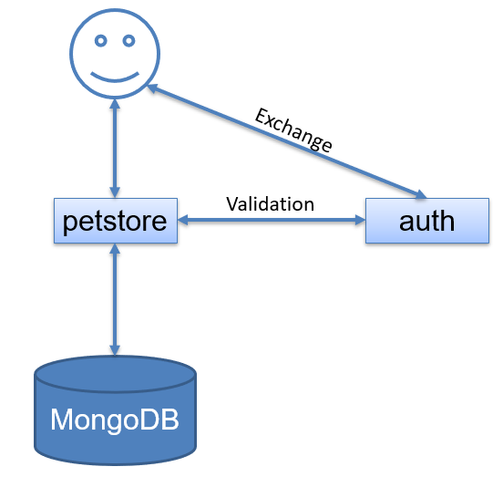

# Projeto prático da disciplina DM124
## Desenvolvimento de Web Services com segurança sob plataforma Node.js

Este projeto se trata de um exemplo didático de como se utilizar de um mecanismo de token exchange/validation para realizar autenticação em uma arquitetura de microserviços utilizando JWT.  

Este projeto é composto por dois microserviços desenvolvidos em Node.js utilizando Express que se comunicam entre si e também com um banco de dados não relacional MongoDB. O projeto segue a estrtura abaixo:  



### Serviço Petstore

Este é o serviço que gerencia as entidades Pet (que estão no domínio de negócios do projeto). Para configurar a sua execução deve-se alterar os valores definidos no arquivo de variáveis de ambiente `petstore/.env`:  

`PORT`: porta utilizada pelo serviço Petstore.  
`MONGODB_HOST`: host do banco de dados MongoDB.  
`MONGODB_PORT`: porta do banco de dados MongoDB.  
`MONGODB_DBNAME`: nome do esquema que será utilizado pela aplicação no banco de dados MongoDB.  
`AUTH_SERVER`: endereço completo da localização do serviço Auth, e.g, `http://localhost:3001`  

#### Rotas disponíveis

Abaixo temos as rotas disponíveis pelo serviço Petstore (importe o arquivo `DM124.postman_collection.json` no Postman para exemplos de payloads):

`POST http://<petstore_host>:<petstore_port>/pet`: Cria um novo Pet.  
`GET http://<petstore_host>:<petstore_port>/pet`: Busca todos os Pets.  
`GET http://<petstore_host>:<petstore_port>/pet?nome=<nome>`: Busca Pet por nome.  

### Serviço Auth

Este serviço é responsável por duas funções:  
1) Gerar um token baseado na combinação usuário e senha.  
2) Validar se o token passado nas requisições realmente é um token válido.  

Para configurar a sua execução deve-se alterar os valores definidos no arquivo de variáveis de ambiente `auth/.env`:  

`PORT`: porta utilizada pelo serviço Auth.  
`CHAVE_PRIVADA`: chave de criptografia privada utilizada no encode/decode do token JWT.  
`TEMPO_EXP`: tempo de expiração do token JWT.  

#### Rotas disponíveis

Abaixo temos as rotas disponíveis pelo serviço Auth (importe o arquivo `DM124.postman_collection.json` no Postman para exemplos de payloads):

`POST http://<auth_host>:<auth_port>/auth/login`: Realiza o login gerando o token baseado no usuário e senha.  
`POST http://<auth_host>:<auth_port>/auth/validaToken`: Valida se o token passado na request é valido.  

## Dependências e execução local

Para rodar o projeto localmente (após configurar corretamente os arquivos `petstore/.env` e `auth/.env`) abra dois terminais - um na pasta `petstore` e um na pasta `auth` - e execute os mesmos comandos em ambas:

```shell
> npm install
> npm run dev
```

## Docker Compose

Para executar a aplicação utilizando o docker compose, configure corretamente os arquivos `petstore/.env`, `auth/.env` e `docker-compose.yaml`, e então execute o comando abaixo na raiz do repositório (onde está o arquivo `docker-compose.yaml`):

```shell
> docker compose up --build
```